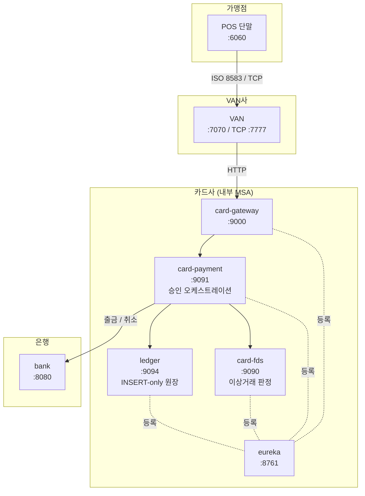

# 카드 결제 시스템

POS 단말부터 은행까지 카드 결제 전 구간을 각 주체로 구현한 분산 결제 시스템.
우리FISA 팀 프로젝트의 승인 경로를 이어받아, **카드사 내부를 승인·원장·이상거래탐지로 분리하고 분산 환경의 결제 정합성 문제를 해결**했다.

> 이 저장소는 시스템 전체를 설명하는 진입점이다. 실행 코드는 아래 서비스별 저장소에 있다.

---

## 다루는 문제

결제는 돈이 오가기 때문에 두 가지가 핵심이다.

1. **한 번만 처리되어야 한다** — 네트워크가 끊기면 단말은 성공 여부를 모르고 재시도한다. 이를 새 결제로 처리하면 이중결제가 된다.
2. **기록이 실제와 어긋나면 안 된다** — 은행 출금은 성공했는데 승인 원장 기록이 실패하면, 돈은 빠졌는데 근거가 없는 상태가 된다.

이 저장소의 시스템은 멱등성·보상 트랜잭션·망취소·대사 배치로 위 두 문제를 다룬다.

---

## 아키텍처



**카드사 내부만 서비스 레지스트리에 등록한다.** 은행은 다른 회사이므로 서비스 디스커버리 대상이 아니라 고정 엔드포인트로 연동한다. MSA는 한 조직이 배포를 통제하는 범위의 아키텍처이고, 회사 경계를 넘는 구간은 기업 간 연동이라고 판단했다.

```java
@FeignClient(name = "ledger-service")                            // 내부 → 레지스트리에서 이름으로 찾음
@FeignClient(name = "bank-service", url = "${bank.service.url}") // 외부 → 고정 주소
```

---

## 서비스 구성

| 서비스 | 포트 | 소속 | 역할 | 저장소 |
|---|---|---|---|---|
| pos-client | 6060 | 가맹점 | POS 단말 에뮬레이터 (ISO 8583 전문 생성·TCP 전송) | [noiskk/pos-client](https://github.com/noiskk/pos-client) |
| VAN-service | 7070 / TCP 7777 | VAN사 | 전문 수신·검증·카드사 라우팅 | [noiskk/van-service](https://github.com/noiskk/van-service) |
| card-gateway | 9000 | 카드사 | 내부 단일 진입점 (Spring Cloud Gateway) | [noiskk/card-service](https://github.com/noiskk/card-service) |
| eureka-server | 8761 | 카드사 | 내부 서비스 레지스트리 | [noiskk/card-service](https://github.com/noiskk/card-service) |
| card-payment-service | 9091 | 카드사 | 승인 오케스트레이션·멱등성·보상·대사 배치 | [noiskk/card-service](https://github.com/noiskk/card-service) |
| card-fds-service | 9090 | 카드사 | 이상거래 판정 (leaf) | [noiskk/card-service](https://github.com/noiskk/card-service) |
| ledger-service | 9094 | 카드사 | INSERT-only 승인 원장·정산 배치 | [noiskk/card-service](https://github.com/noiskk/card-service) |
| bank-service | 8080 | 은행 | 계좌·출금·취소·동시성 제어 | [noiskk/bank-service](https://github.com/noiskk/bank-service) |

**응답코드**: `00` 승인 · `14` 카드상태 · `51` 잔액/한도부족 · `61` 1회한도초과 · `94` 중복의심 · `96` 시스템오류

---

## 핵심 설계 결정

### 1. 타임아웃 시 취소를 보내지 않는다

은행 호출이 타임아웃되면 출금이 됐는지 알 수 없다.

| 선택 | 결과 |
|---|---|
| 실패로 간주하고 취소 전송 | 출금이 안 됐다면 **계좌에 없던 돈이 생긴다** |
| 실패로 기록 | 실제로 출금됐다면 장부와 실제가 어긋난다 |
| **판단을 보류하고 대사** | 채택 |

취소를 보내지 않고 불확실 거래로 저장한 뒤, 대사 배치가 은행에 재확인해 취소하거나 종결한다.
은행 취소 API가 `originalFound`를 함께 반환해서 **한 번의 호출로 "출금 자체가 없었음"과 "출금됐고 취소함"을 구분**한다.

> **"모른다"를 "실패했다"로 바꿔 기록하지 않는다.**

### 2. 되돌리는 연산도 멱등해야 한다

대사 배치는 실패하면 재시도한다. 취소를 보냈지만 응답을 못 받은 경우 다음 회차가 또 취소를 보내면 잔액이 두 번 복구된다.
→ 취소 거래를 `CANCEL-{원거래ID}` 참조번호로 저장하고, 취소 전에 그 기록이 있는지 먼저 확인한다. 복구 금액도 요청값이 아니라 원거래에 기록된 금액을 쓴다.

### 3. 원장 분리가 문제를 드러냈다

원장이 승인 서비스의 로컬 테이블일 때는 `@Transactional` 하나가 모든 것을 보장하는 것처럼 보였다. 그러나 **은행 출금은 원격 호출이라 애초에 롤백 대상이 아니었다.** 원장을 독립 서비스로 분리하자 "출금 성공 + 원장 기록 실패"를 명시적으로 처리해야 했고, 보상 트랜잭션 설계로 이어졌다.

### 4. 이상거래 탐지는 점수로 판단한다

통과/차단 이진 판정은 오탐 비용이 크다. 1분에 네 건 결제는 의심스럽지만 나눠 결제하는 정상 고객도 있다.
그래서 룰마다 점수를 매겨 합산하고 구간별로 조치를 나눴다.

| 점수 | 판정 | 조치 |
|---|---|---|
| 0~39 | `APPROVE` | 승인 |
| 40~69 | `REVIEW` | 승인하되 표시 (실무라면 추가 인증·모니터링) |
| 70~ | `BLOCK` | 차단 |

단일 룰로는 대부분 차단 구간에 닿지 않고 **신호가 겹칠 때** 올라간다.
카드 상태(미등록·정지)만 예외로, 확정된 사실이라 점수 대상에서 빼고 즉시 차단한다.

**두 종류의 과거 데이터를 분리했다** — velocity 계열이 보는 단기 이력(인메모리, 분 단위)과,
평소 사용 패턴을 보는 장기 프로파일(DB, 배치 집계)은 저장소도 갱신 주기도 다르다.
실시간 판정 경로에서 수개월치를 매번 집계할 수 없기 때문이다.

**멱등키 재시도는 velocity에 집계하지 않는다.** velocity는 "서로 다른 결제가 몰아치는가"를 보는데,
같은 결제의 재시도를 세면 장애 후의 정당한 재시도가 이상거래로 차단된다.

### 5. 배치는 데이터를 소유한 서비스에 둔다

| | 망취소 대사 (card-payment) | 가맹점 정산 (ledger) |
|---|---|---|
| 목적 | 실패 복구 | 정기 업무 |
| 재실행 정책 | **될 때까지 다시** | **정확히 한 번** |

같은 Spring Batch를 쓰지만 재실행 정책이 정반대다. 배치를 한곳에 모으면 남의 DB를 직접 읽어야 해서, 각 데이터 소유 서비스에 배치했다.

정산은 적용한 수수료율을 결과와 함께 저장한다. 요율이 바뀐 뒤에도 과거 정산의 계산 근거를 재현할 수 있어야 하기 때문이다.

---

## 트러블슈팅 기록

| 증상 | 원인 | 조치 |
|---|---|---|
| 실패 기록이 DB에 남지 않음 | 예외를 던지며 롤백되는 흐름인데 기본 전파라 기록도 함께 지워짐. **실패했을 때 남겨야 하는 기록이 실패 때문에 사라지는 구조** | `REQUIRES_NEW`로 독립 커밋. 기록을 먼저 남기고 취소를 시도하도록 순서 변경 |
| 배치가 2회차부터 아무것도 처리하지 않음 (Job은 성공으로 종료) | Reader가 싱글턴이라 id 커서가 실행 간에 남음 | `@StepScope` |
| 배치가 일부 건을 조용히 건너뜀 | 처리한 건이 조회 조건에서 빠지며 결과 집합이 줄어 페이지 번호가 밀림 | keyset paging (id 커서) |
| FDS 기동 실패 | 같은 `cards` 테이블을 FDS는 DATE, payment는 TIMESTAMP로 매핑. **기동 순서에 따라 스키마가 달라지는 상태** | 소유 서비스 정의에 맞춤 |
| FDS 장애가 은행 장애로 보고됨 | 예외 메시지에 서비스명이 하드코딩. 이후 다른 호출에 재사용하며 메시지만 그대로 남음 | 실패한 서비스명을 인자로 전달 |
| 정상 거절이 시스템 장애로 분류됨 | 은행이 거절을 422로 응답, Feign은 비2xx를 예외로 던짐 | 비즈니스 거절은 200 + 응답코드로 통일 |

---

## 실행

MySQL 없이 H2 인메모리로 바로 띄울 수 있다.

```bash
# 저장소 4개를 같은 디렉터리에 클론
git clone https://github.com/noiskk/card-service.git
git clone https://github.com/noiskk/bank-service.git
git clone https://github.com/noiskk/van-service.git
git clone https://github.com/noiskk/pos-client.git
```

**기동 순서가 중요하다.** 승인 서비스가 FDS·원장을 이름으로 찾기 때문에 레지스트리가 먼저 떠 있어야 한다.

```bash
# 1) 서비스 레지스트리
cd card-service/eureka-server        && sh gradlew bootRun

# 2) 카드사 내부 leaf + 은행
cd card-service/ledger-service       && sh gradlew bootRun --args='--spring.profiles.active=local'
cd card-service/card-fds-service     && sh gradlew bootRun --args='--spring.profiles.active=local'
cd bank-service                      && sh gradlew bootRun --args='--spring.profiles.active=local'

# 3) 승인 서비스
cd card-service/card-payment-service && sh gradlew bootRun --args='--spring.profiles.active=local'

# 4) 게이트웨이 → VAN → POS
cd card-service/card-gateway         && sh gradlew bootRun
cd van-service                       && sh gradlew bootRun
cd pos-client                        && sh gradlew bootRun
```

MySQL로 실행하려면 `--args` 없이 `export DB_PASSWORD=<비밀번호>` 후 기동한다.

브라우저에서 **http://localhost:6060** 접속 → 카드번호 `4111111111111111`, 금액 `50000`, 가맹점 `MERCHANT-001` 입력.

---

## 관제 화면

각 서비스가 자기 역할에 맞는 관제 화면을 제공한다. 탭을 나란히 띄우면 결제가 각 서비스를 지나가는 것을 볼 수 있다.

| 화면 | 주소 | 내용 |
|---|---|---|
| POS 단말 | http://localhost:6060 | 결제 입력 |
| VAN 중계 모니터 | http://localhost:7070 | 중계 내역, TCP/HTTP 채널, 멱등키 |
| 이상거래 탐지 | http://localhost:9090 | 판정 이력, 차단율, 탐지 규칙 |
| 승인 관제 | http://localhost:9091 | 불확실 거래 + 대사 배치 실행, 멱등키 현황, 카드 마스터 |
| 승인 원장 | http://localhost:9094 | 원장, 정산 배치 실행, 가맹점별 정산 결과 |
| 계좌 원장 | http://localhost:8080 | 계좌 잔액, 거래 내역(출금/취소) |
| 서비스 레지스트리 | http://localhost:8761 | 카드사 내부 서비스 등록 현황 |

<!-- 콘솔 스크린샷을 여기에 추가하면 좋다. GitHub 이슈에 이미지를 드래그해 올리고 생성된 URL을 로 삽입. -->

**확인해볼 시나리오**

1. **멱등성** — 같은 멱등키로 두 번 요청하면 은행 출금은 한 번만 일어난다
2. **망취소** — 은행을 내리고 결제하면 승인 관제에 불확실 거래가 `PENDING`으로 쌓이고 상태가 `DEGRADED`로 바뀐다. 은행을 올리고 대사 배치를 실행하면 `RESOLVED`로 정리된다
3. **정산** — 원장 화면에서 정산을 두 번 실행해도 정산 레코드는 늘어나지 않는다

---

## 기술 스택

- **언어/프레임워크**: Java 17, Spring Boot 3.2.0
- **분산**: Spring Cloud Gateway, Netflix Eureka, OpenFeign
- **데이터**: Spring Data JPA, MySQL (H2 프로파일 제공)
- **배치**: Spring Batch
- **전문통신**: ISO 8583 (j8583) over TCP
- **화면**: Thymeleaf
- **테스트**: JUnit 5, Mockito, AssertJ — 64개

레퍼런스: [토스페이먼츠 레거시 개편 시리즈](https://toss.tech/series/payments-legacy)

---

## 알려진 한계

의도적으로 범위에서 제외한 것들이다.

- **카드 마스터가 공유 DB** — card-payment와 card-fds가 `cards` 테이블을 공유한다. 실제로 타입 불일치 문제가 발생했고, 조회 API로 전환하는 것이 다음 과제다
- **서비스 간 인증 없음** — 현재 전부 `permitAll`
- **카드번호 평문 처리** — 실제 서비스라면 PCI-DSS상 마스킹·토큰화가 필요하다
- **부하 테스트 미실시** — 목적이 정합성이었다. 측정 없이 성능을 주장하지 않는다
- **이벤트 기반 미적용** — 승인은 결과를 즉시 돌려줘야 하는 동기 흐름이라 오케스트레이션을 택했다. 정산·통계 같은 후속 처리에는 이벤트가 적합하다고 보고 검토만 했다
